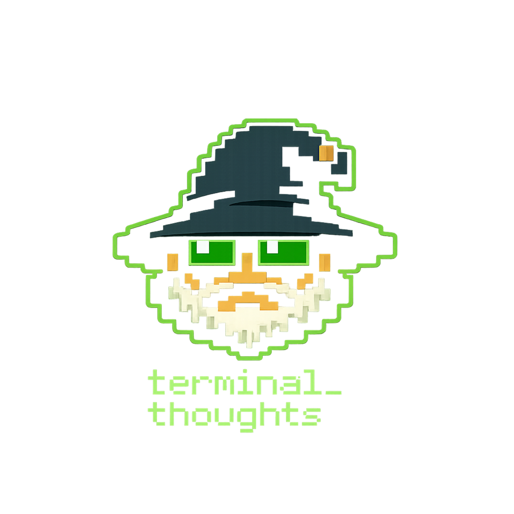

<div align="center">
  
</div>

<div align="center">

apparel for people who live in terminals, think in systems,
and appreciate a well-placed `.md` file.

**[shop drop_01 →](https://terminalthoughts.dev)**

</div>

---

```
status: live
drop: 01
phrases: agents.md / skill_issue.md
fulfillment: made when you order it
```

---

you already know what this is.

---

## drop_01

```
agents.md        (thinking...)
skill_issue.md   * whirring....
```

**[→ terminalthoughts.dev](https://terminalthoughts.dev)**

---

## do_good.md

every order moves something. drop_01:

```
agents.md      → $2/order → One Tree Planted
skill_issue.md → $2/order → Mental Health America
```

[DO_GOOD.md](DO_GOOD.md) — the log. the wizard keeps receipts.

---

## how a design becomes a shirt

you see something in a terminal at 2am that should be on a shirt.
a phrase. a filepath. a command. a symbol. an error you've seen a hundred times.
anything terminal-native. you open a PR. you wait.

the wizard opens a window when the wizard feels like it.
you have 48 hours. the wizard does not negotiate.
merged = it's getting made. closed = not this time. no appeals.

if it gets merged — you pick a charity. a cut of every sale goes there. permanently.

```
* the wizard is watching.
```

[IDEAS.md](IDEAS.md) — what's already in the queue. don't submit duplicates. the wizard hates that.
[WIZARD.md](WIZARD.md) — wizard status. read this before asking when the next window is.
[CONTRIBUTING.md](CONTRIBUTING.md) — yes there are rules. yes you should read them.

---

## coming up

```
ran_out_of_tokens.md   (context limit reached)
```

---

<div align="center">
<sub>terminal_thoughts™ — by <a href="https://github.com/gamertagged-studios">Gamertagged Studios</a></sub>
</div>
